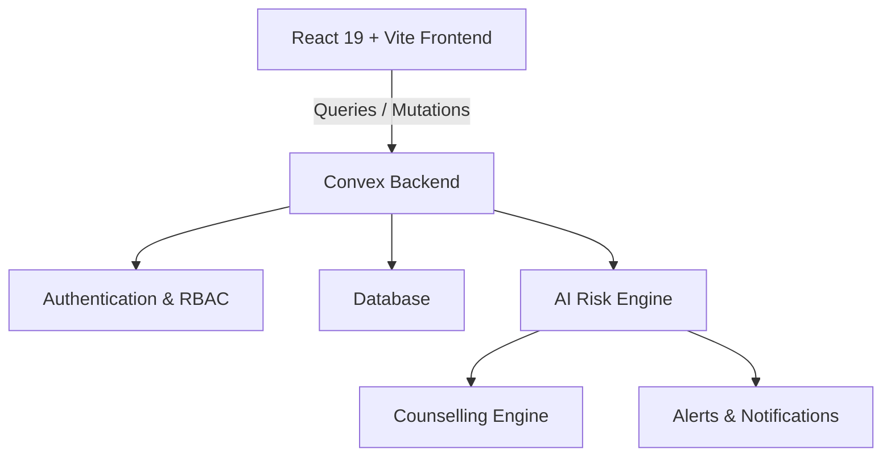
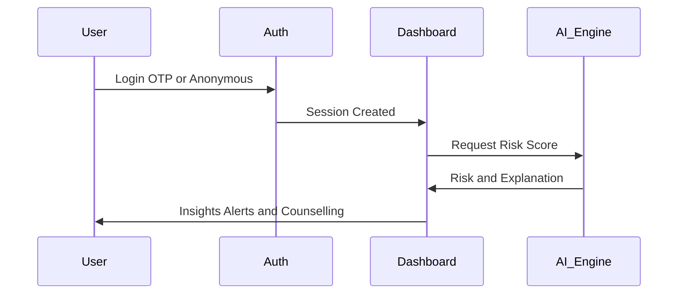

# 🎓 RiskWise  
## AI-Based Dropout Prediction & Counselling System

<p align="center">
  
  
  
</p>

<p align="center">
  <a href="https://riskwise.vly.site"><strong>🚀 Live Prototype</strong></a>
</p>

---

## 📌 Overview

**RiskWise** is a full-stack AI platform developed for **Smart India Hackathon 2025 (SIH25102)**. Our mission is to **predict student dropout risk early** and facilitate **timely counselling, alerts, and interventions**.

The platform provides **role-based dashboards**, **AI-driven risk prediction**, **explainable insights (XAI)**, and **automated support workflows** tailored for students, mentors, institutions, parents, and policymakers.

---

## 🏆 Hackathon Details

| Attribute | Details |
| :--- | :--- |
| **Event** | Smart India Hackathon 2025 |
| **Theme** | Smart Automation |
| **Category** | Software |
| **Problem Statement** | AI-based Dropout Prediction & Counselling System |
| **Team** | ADVITEEY |
| **Achievement** | 🥉 Top 3 – Internal Hackathon |

---

## ✨ Key Features

* 🔐 **Secure Access:** Email OTP & Anonymous Authentication.
* 📊 **Role-Based Dashboards:** Custom views for Students, Mentors, and Admins.
* 🧠 **AI Risk Engine:** Real-time dropout risk prediction using machine learning.
* 🔍 **Explainable AI:** XAI-ready logic to provide reasons behind risk scores.
* 💬 **24/7 Support:** AI-powered counselling chatbot for immediate student assistance.
* 💸 **Financial Aid:** Built-in Scholarship Recommendation Engine.
* 🔔 **Smart Alerts:** Automated notifications for stakeholders when risk levels fluctuate.
* 📱 **Modern UI:** Mobile-first design with fluid Framer Motion animations.

---

## 🧱 System Architecture

### High-Level Logic

## 🔄 User Flow


    
## 🛠 Tech Stack

### Frontend
- **Framework:** React 19 + Vite  
- **Language:** TypeScript  
- **Routing:** React Router v7  
- **Styling:** Tailwind CSS v4 (OKLCH), Shadcn UI  
- **Animations:** Framer Motion, Three.js  
- **Icons:** Lucide Icons  

---

### Backend & Database
- **Platform:** Convex  
  - Real-time Database  
  - Queries  
  - Mutations  
  - Actions  
- **Authentication:** Convex Auth  
  - Email OTP  
  - Anonymous Login  

---

### AI / ML Layer
- Dropout risk prediction models  
- Explainable AI (XAI) logic  
- Counselling & recommendation pipelines  

---

## 📂 Project Structure

```bash
src/
 ├─ components/
 │   └─ ui/              # Reusable Shadcn components
 ├─ pages/               # Application views & routes
 ├─ hooks/               # Custom React hooks (Auth, Theme, etc.)
 ├─ convex/              # Backend schema and server functions
 │   ├─ auth/            # Core Auth Logic (Internal)
 │   ├─ schema.ts        # Database Schema
 │   └─ users.ts         # User-related Mutations & Queries
 ├─ styles/              # Global CSS and Tailwind config
 └─ main.tsx             # Application entry point
